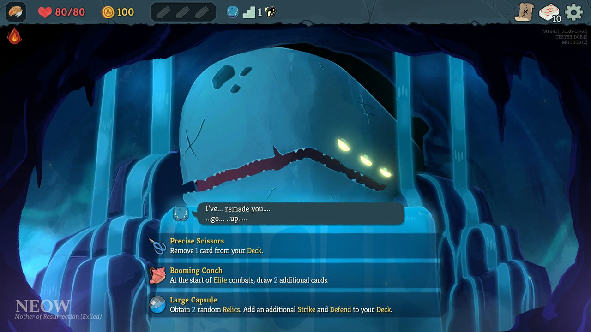
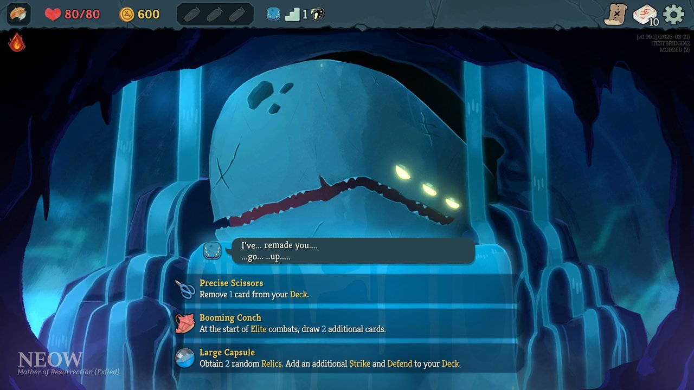
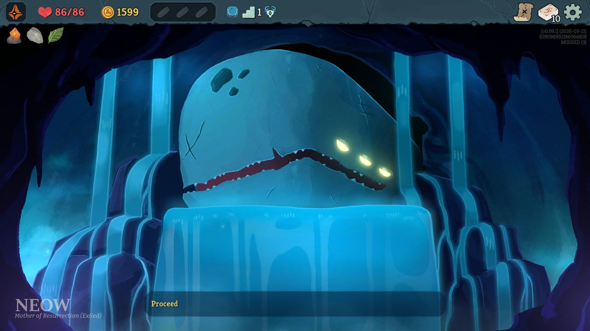

# Custom UI Elements — The Complete Guide

## Overview

Slay the Spire 2 runs on Godot 4.5 with C# .NET 9.0. Mods build UI entirely in C# code using Godot's `Control` node system — no `.tscn` scene files needed. Custom UI elements are injected into the game's scene tree via Harmony patches on room `_Ready()` methods and update each frame via the `SceneTree.ProcessFrame` signal.

This guide covers five major UI patterns with working example code:
1. **HUD Overlays** — Persistent stat displays (combat stats, timers)
2. **Floating Info Panels** — Mouse-following BBCode tooltips
3. **Interactive Settings Panels** — Checkboxes, sliders, hotkey toggles with CanvasLayer
4. **Animated Progress Bars** — HP bars with tweens, color gradients, pulse effects
5. **Scrollable Lists** — Deck trackers, log viewers with slide animation

### All Five Elements Running In-Game


*Combat with all five UI mods active: stats overlay (top-right), floating info panel (center), deck tracker (right edge), animated HP/floor bars (bottom-left)*


*Combat stats HUD (top-right) and animated HP + floor progress bars (bottom-left)*


*Interactive settings panel with checkbox, opacity slider, and close button — rendered above all game UI via CanvasLayer*

## Critical Architecture: Why Not Subclass Control?

External mod DLLs loaded by the game **cannot** use custom Godot node subclasses with virtual method overrides (`_Ready`, `_Process`, `_Input`). This is because Godot's source generator, which wires up virtual methods at compile time, only runs for the main game assembly. Mod DLLs bypass this registration.

**The solution**: use **static classes** that build UI from stock Godot nodes, and wire up frame updates via the `SceneTree.ProcessFrame` signal instead of overriding `_Process()`.

```csharp
// WRONG — _Process and _Ready won't fire in a mod DLL
public partial class MyOverlay : Control
{
    public override void _Ready() { /* never called */ }
    public override void _Process(double delta) { /* never called */ }
}

// CORRECT — static class that builds UI from stock nodes
public static class MyOverlay
{
    public static Control? Root { get; private set; }

    public static void Inject(Node parent)
    {
        var root = new Control();
        root.Name = "MyOverlay";
        // ... build UI with AddChild ...
        parent.AddChild(root);
        Root = root;

        // Use signal for frame updates instead of _Process override
        root.GetTree().ProcessFrame += Update;
        root.TreeExiting += () => { Root = null; };
    }

    private static void Update() { /* called every frame */ }
}
```

## Injection Architecture

### The Harmony Patch Pattern

Every custom UI element follows the same injection pattern:

```csharp
[HarmonyPatch(typeof(NCombatRoom), "_Ready")]
public static class MyOverlayPatch
{
    public static void Postfix(NCombatRoom __instance)
    {
        MyOverlay.Inject(__instance);
    }
}
```

The Harmony `Postfix` runs after the game's `_Ready()` method, giving you a fully initialized scene tree to add children to.

### Injection Targets

| Target Class | When Visible | Use For |
|---|---|---|
| `NCombatRoom` | During combat encounters | Stat trackers, deck viewers, combat-specific HUD |
| `NMapRoom` | On the map screen | Map annotations, route planners |
| `NMerchantRoom` | In shops | Price comparisons, buy recommendations |
| `NRestSiteRoom` | At rest sites | Upgrade advisors |
| `NEventRoom` | During events | Choice outcome predictions |
| `NGame` | **Always** — persists across all scenes | Settings panels, global overlays, hotkey handlers |

### Input Handling

Since `_Input()` overrides don't work in mod DLLs, hook into `NGame._Input` with a Harmony patch:

```csharp
[HarmonyPatch(typeof(NGame), "_Input")]
public static class InputPatch
{
    public static void Postfix(InputEvent inputEvent)
    {
        if (inputEvent is InputEventKey keyEvent && keyEvent.Pressed && !keyEvent.Echo)
        {
            switch (keyEvent.Keycode)
            {
                case Key.F7: FloatingInfoPanel.Toggle(); break;
                case Key.F8: ModSettingsPanel.Toggle(); break;
                case Key.F9: DeckTrackerPanel.Toggle(); break;
            }
        }
    }
}
```

### Preventing Duplicate Injection

Always check if already injected before creating new nodes:

```csharp
public static void Inject(Node parent)
{
    if (Root != null && GodotObject.IsInstanceValid(Root)) return;
    // ... create UI ...
}
```

### Cleanup on Scene Exit

Register a `TreeExiting` handler to null the static reference so the next scene creates a fresh instance:

```csharp
root.TreeExiting += () => {
    Root = null;
    root.GetTree().ProcessFrame -= Update;  // Unsubscribe from frame updates
};
```

---

## Example 1: Combat Stats HUD Overlay

A persistent panel in the top-right corner showing turn number, cards played, and gold — updated every frame by reading game state.

### Key Concepts
- **Positioning with anchors**: `AnchorLeft = 1f` pins to the right edge
- **StyleBoxFlat**: Custom backgrounds with borders, corner radius, padding
- **ProcessFrame signal**: Per-frame updates without `_Process()` override
- **Game state access**: `RunManager.Instance.DebugOnlyGetState()` for player data, `CombatManager.Instance.DebugOnlyGetState()` for combat data

### Code Pattern
```csharp
public static class CombatStatsOverlay
{
    public static Control? Root { get; private set; }
    private static Label? _turnLabel, _goldLabel, _cardsLabel;

    public static void Inject(Node parent)
    {
        if (Root != null && GodotObject.IsInstanceValid(Root)) return;

        var root = new Control();
        root.Name = "CombatStatsOverlay";
        // Pin to top-right
        root.AnchorLeft = 1f;
        root.AnchorRight = 1f;
        root.OffsetLeft = -220;
        root.OffsetTop = 80;
        root.OffsetRight = -10;
        root.OffsetBottom = 260;
        root.MouseFilter = Control.MouseFilterEnum.Ignore;

        // Styled panel background
        var panel = new PanelContainer();
        var style = new StyleBoxFlat();
        style.BgColor = new Color(0.08f, 0.08f, 0.12f, 0.85f);
        style.BorderColor = new Color(0.9f, 0.75f, 0.2f, 0.8f);
        style.SetBorderWidthAll(2);
        style.SetCornerRadiusAll(6);
        style.SetContentMarginAll(10);
        panel.AddThemeStyleboxOverride("panel", style);
        root.AddChild(panel);

        var vbox = new VBoxContainer();
        panel.AddChild(vbox);

        // Title + stats labels...
        _turnLabel = new Label { Text = "Turn: 1" };
        _goldLabel = new Label { Text = "Gold: 0" };
        // ... add to vbox ...

        parent.AddChild(root);
        Root = root;
        root.GetTree().ProcessFrame += Update;
        root.TreeExiting += () => { Root = null; };
    }

    private static void Update()
    {
        var state = RunManager.Instance?.DebugOnlyGetState();
        if (state?.Players.Count > 0)
        {
            _goldLabel!.Text = $"Gold: {state.Players[0].Gold}";
            var combat = CombatManager.Instance?.DebugOnlyGetState();
            if (combat != null) _turnLabel!.Text = $"Turn: {combat.RoundNumber}";
        }
    }
}
```

---

## Example 2: Floating Info Panel

A mouse-following panel with BBCode rich text that toggles with F7. Great for contextual tooltips, card details, or mod documentation overlays.

### Key Concepts
- **Mouse tracking**: `GetGlobalMousePosition()` in the ProcessFrame handler
- **RichTextLabel with BBCode**: `[b]bold[/b]`, `[color=#ff0]yellow[/color]`, `[i]italic[/i]`
- **Edge detection**: Flip panel position when near screen edges
- **Toggle pattern**: Static boolean + Show/Hide methods

### Code Pattern
```csharp
private static void ProcessUpdate()
{
    if (!_isVisible || _panel == null) return;
    var mouse = Root!.GetGlobalMousePosition();
    var size = _panel.Size;
    var vp = Root.GetViewportRect().Size;
    float x = mouse.X + 20;
    float y = mouse.Y + 15;
    // Flip at edges
    if (x + size.X > vp.X - 10) x = mouse.X - size.X - 10;
    if (y + size.Y > vp.Y - 10) y = mouse.Y - size.Y - 10;
    _panel.Position = new Vector2(x, y);
}
```

---

## Example 3: Interactive Settings Panel

A centered modal with CanvasLayer (renders above everything), dimming backdrop, checkbox, slider, and close button. Toggle with F8.

### Key Concepts
- **CanvasLayer**: `Layer = 100` renders above all game UI
- **ColorRect backdrop**: Semi-transparent black overlay behind the panel
- **CheckButton**: Toggle with `Toggled` signal for boolean settings
- **HSlider**: Drag value with `ValueChanged` signal for numeric settings
- **ButtonGroup**: Radio button groups for exclusive options

### Code Pattern
```csharp
// CanvasLayer for top-level rendering
var canvas = new CanvasLayer();
canvas.Layer = 100;
root.AddChild(canvas);

// Dimming backdrop
var backdrop = new ColorRect();
backdrop.Color = new Color(0, 0, 0, 0.5f);
backdrop.SetAnchorsPreset(Control.LayoutPreset.FullRect);
canvas.AddChild(backdrop);

// Centered panel
var panel = new PanelContainer();
panel.SetAnchorsPreset(Control.LayoutPreset.Center);
panel.GrowHorizontal = Control.GrowDirection.Both;
panel.GrowVertical = Control.GrowDirection.Both;
canvas.AddChild(panel);

// Interactive controls
var check = new CheckButton { Text = "Enable Feature", ButtonPressed = true };
check.Toggled += (bool on) => { /* handle toggle */ };

var slider = new HSlider();
slider.MinValue = 0.2; slider.MaxValue = 1.0; slider.Step = 0.05;
slider.ValueChanged += (double val) => { /* handle value change */ };
```

---

## Example 4: Animated Progress Bars

HP and floor progress bars with color gradients (green → yellow → red) that update smoothly. The HP bar turns green when full, yellow when mid, and red when low.

### Key Concepts
- **ProgressBar styling**: `StyleBoxFlat` for both `background` and `fill` theme overrides
- **Color interpolation**: Lerp between colors based on fill ratio
- **Live game state**: Read `player.Creature.CurrentHp` and `player.Creature.MaxHp`

### Code Pattern
```csharp
// Create styled progress bar
var bar = new ProgressBar();
bar.CustomMinimumSize = new Vector2(220, 18);
bar.ShowPercentage = false;

var bg = new StyleBoxFlat();
bg.BgColor = new Color(0.15f, 0.15f, 0.2f);
bg.SetCornerRadiusAll(4);
bar.AddThemeStyleboxOverride("background", bg);

var fill = new StyleBoxFlat();
fill.BgColor = new Color(0.2f, 0.85f, 0.3f);  // Green when full
fill.SetCornerRadiusAll(4);
bar.AddThemeStyleboxOverride("fill", fill);

// Update with color gradient
float ratio = (float)hp / maxHp;
Color barColor;
if (ratio > 0.6f) barColor = new Color(0.2f, 0.85f, 0.3f);      // Green
else if (ratio > 0.3f) barColor = new Color(0.95f, 0.8f, 0.15f); // Yellow
else barColor = new Color(0.9f, 0.2f, 0.15f);                    // Red
```

---

## Example 5: Scrollable Deck Tracker

A side panel that slides in from the right, showing draw pile contents grouped by card name with color-coded type indicators. Toggle with F9.

### Key Concepts
- **ScrollContainer**: Automatic scrolling when content exceeds visible area
- **VBoxContainer**: Vertical list layout with dynamic item addition
- **Dictionary grouping**: Count duplicate cards by name
- **Color-coded dots**: `ColorRect` indicators for Attack (red), Skill (blue), Power (yellow)
- **Card type**: Access via `card.Type` enum (`CardType.Attack`, `CardType.Skill`, `CardType.Power`)

### Code Pattern
```csharp
// Draw pile access
var player = state.Players[0];
var cards = player.PlayerCombatState.DrawPile.Cards;

// Group by name
var groups = new Dictionary<string, (int count, CardType type)>();
foreach (var card in cards)
{
    string name = card.Id.Entry;
    if (groups.ContainsKey(name))
        groups[name] = (groups[name].count + 1, card.Type);
    else
        groups[name] = (1, card.Type);
}

// Create rows with color dots
foreach (var kvp in groups.OrderBy(k => k.Key))
{
    var row = new HBoxContainer();
    var dot = new ColorRect { CustomMinimumSize = new Vector2(8, 8) };
    dot.Color = kvp.Value.type switch
    {
        CardType.Attack => new Color(0.9f, 0.4f, 0.35f),
        CardType.Power => new Color(0.9f, 0.75f, 0.3f),
        _ => new Color(0.4f, 0.7f, 0.9f),
    };
    row.AddChild(dot);
    // ... add name label, count badge ...
    _cardList.AddChild(row);
}
```

---

## Positioning & Anchors

### Anchor System
Anchors range from 0.0 (left/top) to 1.0 (right/bottom). Offsets are pixel adjustments from the anchor point.

```csharp
// Top-right corner (stats overlay)
AnchorLeft = 1f; AnchorRight = 1f;
OffsetLeft = -220; OffsetTop = 80; OffsetRight = -10;

// Bottom-left corner (progress bars)
AnchorTop = 1f;
OffsetLeft = 10; OffsetTop = -130; OffsetRight = 260; OffsetBottom = -10;

// Centered (settings panel)
SetAnchorsPreset(LayoutPreset.Center);
GrowHorizontal = GrowDirection.Both;
GrowVertical = GrowDirection.Both;

// Full screen (click-through overlay)
SetAnchorsPreset(LayoutPreset.FullRect);
MouseFilter = MouseFilterEnum.Ignore;

// Right-edge slide panel (deck tracker)
AnchorLeft = 1f; AnchorRight = 1f;
AnchorTop = 0f; AnchorBottom = 1f;
OffsetLeft = -240; OffsetRight = 0;
OffsetTop = 75; OffsetBottom = -10;
```

### Mouse Passthrough
Set `MouseFilter = Control.MouseFilterEnum.Ignore` on overlay containers so clicks pass through to the game:

```csharp
root.MouseFilter = Control.MouseFilterEnum.Ignore;
panel.MouseFilter = Control.MouseFilterEnum.Ignore;
label.MouseFilter = Control.MouseFilterEnum.Ignore;
```

## Styling Reference

### StyleBoxFlat (Backgrounds & Borders)
```csharp
var style = new StyleBoxFlat();
style.BgColor = new Color(0.08f, 0.08f, 0.12f, 0.85f);   // Dark semi-transparent
style.BorderColor = new Color(0.9f, 0.75f, 0.2f, 0.8f);  // Gold border
style.SetBorderWidthAll(2);                                 // 2px border
style.SetCornerRadiusAll(6);                                // Rounded corners
style.SetContentMarginAll(10);                              // Inner padding
style.ShadowColor = new Color(0, 0, 0, 0.4f);             // Drop shadow
style.ShadowSize = 4;
panel.AddThemeStyleboxOverride("panel", style);
```

### Theme Overrides (Fonts & Colors)
```csharp
label.AddThemeFontSizeOverride("font_size", 16);
label.AddThemeColorOverride("font_color", new Color(1f, 0.85f, 0.3f));
vbox.AddThemeConstantOverride("separation", 4);  // Spacing between children
```

### Color Palette
| Purpose | Color | Code |
|---|---|---|
| Gold text/borders | Warm gold | `new Color(0.9f, 0.75f, 0.2f)` |
| Info/header | Purple-blue | `new Color(0.7f, 0.6f, 1f)` |
| Positive/green | Green | `new Color(0.4f, 0.9f, 0.6f)` |
| Body text | Cream | `new Color(0.9f, 0.9f, 0.85f)` |
| Danger/low HP | Red | `new Color(0.9f, 0.2f, 0.15f)` |
| Panel background | Near-black | `new Color(0.08f, 0.08f, 0.12f, 0.85f)` |

## Reading Game State

### Player Data
```csharp
var run = RunManager.Instance;
var state = run?.DebugOnlyGetState();
if (state?.Players.Count > 0)
{
    var player = state.Players[0];
    int hp = player.Creature.CurrentHp;
    int maxHp = player.Creature.MaxHp;
    int gold = player.Gold;
    int deckSize = player.Deck.Count;
}
```

### Combat Data
```csharp
var combat = CombatManager.Instance?.DebugOnlyGetState();
int round = combat?.RoundNumber ?? 0;
```

### Draw Pile (Card List)
```csharp
var pcs = player.PlayerCombatState;
if (pcs != null)
{
    IReadOnlyList<CardModel> cards = pcs.DrawPile.Cards;
    foreach (var card in cards)
    {
        string name = card.Id.Entry;     // Internal name
        CardType type = card.Type;       // Attack, Skill, Power, Curse, Status
    }
}
```

## Common Control Types

| Control | Use For |
|---|---|
| `Label` | Static text display |
| `RichTextLabel` | BBCode formatted text (`[b]`, `[color]`, `[i]`) |
| `Button` | Clickable with `Pressed` signal |
| `CheckButton` | Toggle with `Toggled` signal |
| `HSlider` / `VSlider` | Value selection with `ValueChanged` signal |
| `ProgressBar` | Fill-based display |
| `ColorRect` | Solid color rectangle (backdrops, indicators) |
| `PanelContainer` | Background panel with `StyleBoxFlat` |
| `VBoxContainer` | Vertical layout |
| `HBoxContainer` | Horizontal layout |
| `ScrollContainer` | Scrollable content area |
| `HSeparator` | Visual divider line |
| `CanvasLayer` | Render above everything (Layer property) |

## Generators

Use these MCP tools to scaffold UI elements automatically:

| Tool | What It Creates |
|---|---|
| `generate_floating_panel` | Mouse-following BBCode info panel with hotkey toggle |
| `generate_animated_bar` | Progress bar with tweens, color gradients, pulse effect |
| `generate_scrollable_list` | Toggleable side panel with dynamic color-coded item list |
| `generate_overlay` | Simple text overlay with `_Process` frame updates |
| `generate_godot_ui` | Generic Control panel with configurable child controls |
| `generate_settings_panel` | JSON-persistent config with optional ModConfig integration |
| `generate_hover_tip` | Hover tooltip helper using the game's built-in `NHoverTipSet` |
